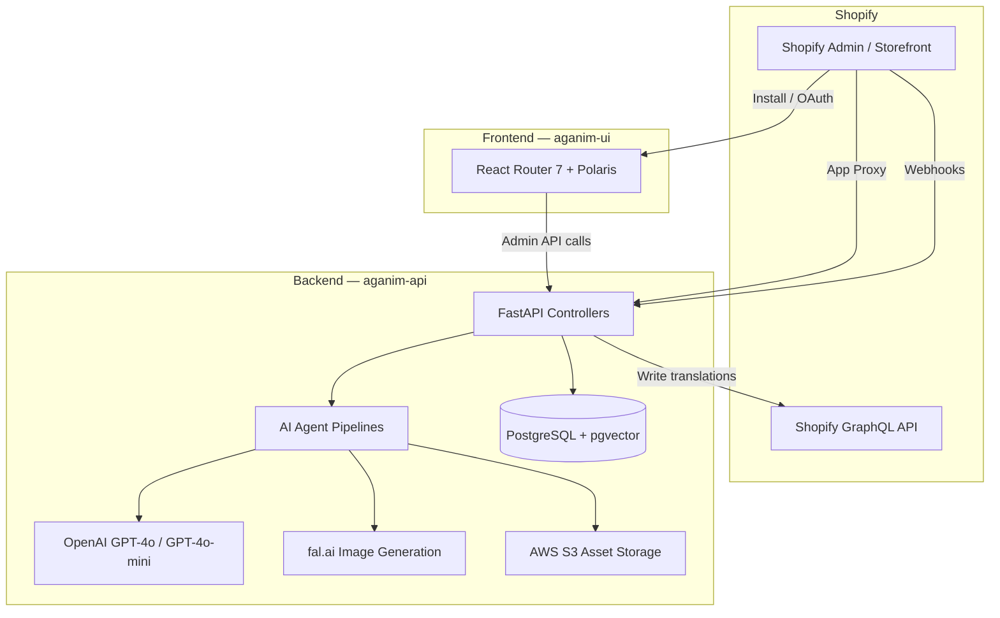

# Aganim AI — API

The backend engine for [Aganim AI](https://aganim-ai.com), powering AI-driven product localization, SEO optimization, competitor pricing analysis, marketing content generation, and multi-agent mission pipelines for Shopify stores. Built with FastAPI and Python 3.13.

## Architecture

```
src/
  agentic_core/        # Generic AI platform (zero Shopify dependencies)
    agents/            # Base agent framework, orchestration
    api/               # Mission router, models
    llm/               # LLM client abstraction
    rag/               # Retrieval-augmented generation
  shared/              # Cross-cutting infrastructure
    config/            # Environment config, feature flags
    db/                # SQLAlchemy engine, session factory
    logging/           # Structured logging
    security/          # HMAC verification, JWT, rate limiting
  ecommerce/           # Shopify domain layer
    agents/            # Domain agents (rewriter, SEO, pricing, marketing, visual)
    api/
      shopify/         # OAuth, admin, proxy, webhook, mission routes
      superadmin/      # Internal portal (merchants, concerns, outreach)
    core/              # Content generation, plan entitlements, templates
    db/                # Domain models (merchants, plans, usage, missions)
    services/          # Shopify API client, billing, product sync
  test/                # Comprehensive test suite
```

### Design Principles

- **`agentic_core/`** is extractable as a standalone service — zero imports from `ecommerce/`
- **`shared/`** provides infrastructure used by both packages
- **`ecommerce/`** contains all Shopify-specific business logic

## System Overview



## API Surface

### Shopify OAuth & Webhooks
| Endpoint | Method | Description |
|----------|--------|-------------|
| `/api/auth/callback` | GET | OAuth callback, merchant provisioning |
| `/webhooks/app/uninstalled` | POST | Cleanup on app removal |
| `/webhooks/subscription-activated` | POST | Plan billing sync |
| `/api/webhooks/compliance` | POST | GDPR data request / redact |

### Admin (Embedded App — JWT verified)
| Endpoint | Method | Description |
|----------|--------|-------------|
| `/api/admin/usage` | GET | Plan usage stats for dashboard |
| `/api/admin/submit-concern` | POST | Merchant feedback (rate-limited) |
| `/api/admin/reinstall-path` | GET | Reinstall detection for returning merchants |

### App Proxy (HMAC signature verified)
| Endpoint | Method | Description |
|----------|--------|-------------|
| `/api/proxy/generate-copy` | POST | AI product rewrite (title + description + SEO) |
| `/api/proxy/seo/*` | POST | SEO analysis, competitor data, CTR scoring |
| `/api/proxy/pricing/*` | POST | Competitor price scraping + AI recommendations |
| `/api/proxy/marketing/*` | POST | Social captions, ad copy, campaigns, email |
| `/api/proxy/visual/*` | POST | Hero image generation, image refinement |
| `/api/proxy/missions/*` | POST | Multi-agent pipeline orchestration |

### Super-Admin Portal
| Endpoint | Method | Description |
|----------|--------|-------------|
| `/api/superadmin/dashboard` | GET | Platform analytics |
| `/api/superadmin/merchants` | GET | Merchant management |
| `/api/superadmin/concerns` | GET | Support ticket triage |
| `/api/superadmin/missions` | GET | Mission monitoring |

## Key Capabilities

- **AI Rewriter** — Brand Soul-aware product localization for 12+ markets
- **SEO Optimizer** — SERP analysis, LSI enrichment, competitor mirroring, CTR best practices
- **Price Scout** — Google-powered competitor pricing with AI-driven recommendations
- **Marketing Studio** — Social media captions, ad copy, seasonal campaigns, email templates
- **Visual Pipeline** — Hero/blog/collection image generation via fal.ai, background removal (rembg)
- **Agentic Missions** — Multi-step AI pipelines chaining rewriter, SEO, pricing, marketing, and visual agents
- **Image Refinement** — AI-enhanced product imagery with background replacement

## Security

| Layer | Mechanism |
|-------|-----------|
| Shopify App Proxy | HMAC signature verification on every request |
| Admin endpoints | Shopify JWT session token validation |
| Server-to-server | `TOKEN_SYNC_SECRET` shared secret header |
| Super-admin portal | Separate JWT auth with role-based access |
| Dev bypass | Gated behind `ENVIRONMENT != "production"` |
| Rate limiting | In-memory sliding window per IP (LLM calls + submit endpoints) |
| Error tracking | Sentry SDK integration |

## Tech Stack

- **Framework:** FastAPI + Uvicorn
- **Language:** Python 3.13
- **Database:** PostgreSQL + pgvector (SQLAlchemy ORM, Alembic migrations)
- **LLM:** OpenAI (GPT-4o, GPT-4o-mini)
- **Image Gen:** fal.ai (FLUX models)
- **Storage:** AWS S3
- **Auth:** PyJWT, HMAC-SHA256
- **Monitoring:** Sentry
- **CI/CD:** GitHub Actions (test on PR, deploy on merge to main)
- **Deployment:** Docker on Render

## Prerequisites

- Python 3.13
- PostgreSQL (with pgvector extension)
- OpenAI API key
- Shopify app credentials

## Local Development

```bash
# Create virtual environment
python -m venv venv
source venv/bin/activate

# Install dependencies
pip install -r requirements.txt

# Start PostgreSQL
docker compose up -d

# Run the server
uvicorn src.ecommerce.api.main:app --reload --port 8000
```

## Environment Variables

| Variable | Description |
|----------|-------------|
| `DATABASE_URL` | PostgreSQL connection string |
| `OPENAI_API_KEY` | OpenAI API key |
| `SHOPIFY_API_KEY` | Shopify app client ID |
| `SHOPIFY_API_SECRET` | Shopify app secret |
| `TOKEN_SYNC_SECRET` | Shared secret for UI-to-API auth |
| `ENVIRONMENT` | `production` or `development` |
| `SENTRY_DSN` | Sentry DSN (optional) |
| `SHOPIFY_REDIRECT_URI` | OAuth redirect URI (defaults to Render URL) |
| `DEPLOYED_APP_URL` | Production API base URL |
| `SHOPIFY_UI_URL` | Production UI base URL |
| `FAL_KEY` | fal.ai API key (for image generation) |
| `AWS_ACCESS_KEY_ID` | AWS S3 credentials |
| `AWS_SECRET_ACCESS_KEY` | AWS S3 credentials |
| `S3_BUCKET_NAME` | S3 bucket for generated assets |

## Testing

```bash
# Run full test suite
pytest

# Run with coverage
pytest --cov=src

# Run specific test file
pytest src/test/test_integration.py -v
```

Test suite includes:
- Integration tests (full API flow with mocked LLM)
- Security tests (JWT validation, HMAC verification, dev-bypass gating)
- Rate limiting tests
- Mission pipeline tests
- Plan entitlement & quota enforcement tests
- Database transaction safety tests

## CI/CD

- **CI:** GitHub Actions runs `pytest` on every push/PR against Python 3.13 with PostgreSQL service
- **CD:** Merge to `main` triggers Render deploy via webhook

## Database Migrations

Managed with Alembic:

```bash
# Generate a new migration
alembic revision --autogenerate -m "description"

# Apply migrations
alembic upgrade head
```

## License

Proprietary. All rights reserved.
