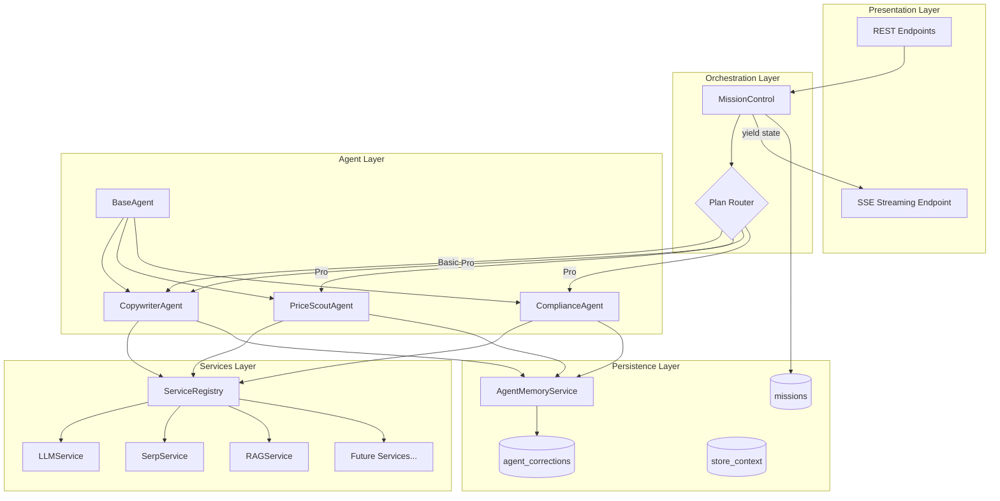
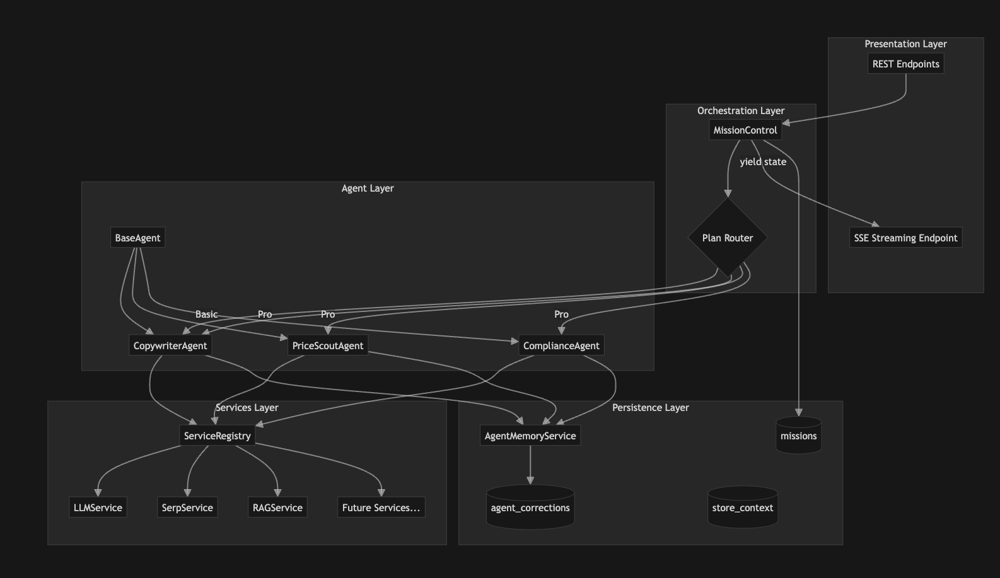
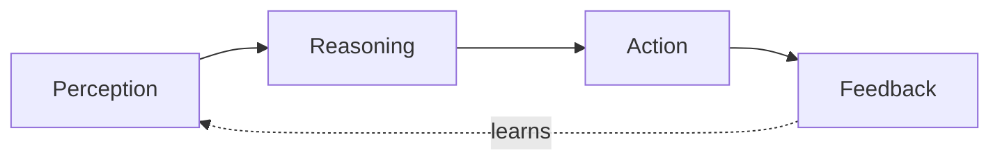

# Agentic Architecture Refactor Plan

This plan transforms your linear SaaS into a Multi-Agent Mission Control Platform as outlined in the LLD.

## Current State Summary

| Component | Location | Current Role |

|-----------|----------|--------------|

| Core generation | [`generation.py`](shopify-translator-api/src/ecommerce/core/generation.py) (~1500 lines) | Monolithic product rewriting pipeline |

| OpenAI Service | [`open_ai_api_service.py`](shopify-translator-api/src/ecommerce/services/openai_legacy_service.py) | Multiple methods with duplicated logic, no structured outputs |

| Agent actions | [`agent_actions.py`](shopify-translator-api/src/ecommerce/core/agent_actions.py) | Simple action handlers (social hooks, campaigns) |

| API layer | [`controller.py`](shopify-translator-api/src/ecommerce/api/controller.py) | REST endpoints with standard request/response |

| Services | [`brand_context_retrieval.py`](shopify-translator-api/src/ecommerce/services/brand_ingest_service.py), [`serp_service.py`](shopify-translator-api/src/agentic_core/tools/serp_service.py) | RAG retrieval, SERP fetching |

| DB models | [`db_models.py`](shopify-translator-api/src/ecommerce/db/models.py) | User, Shop, Plan, StoreContext |

## Architecture Diagram





---

## Phase 0: Services Layer (Prerequisite)

The Services Layer provides a clean abstraction between Agents and external APIs/business logic. Each service is a class with well-defined async methods. Agents receive services via dependency injection through a `ServiceRegistry`.

### 0.1 Create Services Directory Structure

```
src/ecommerce/services/
    __init__.py
    registry.py       # ServiceRegistry for DI
    llm_service.py    # LLMService (OpenAI wrapper)
    serp_service.py   # SerpService (competitor search)
    rag_service.py    # RAGService (brand context retrieval)
```

### 0.2 ServiceRegistry (Dependency Injection)

Create a registry that agents use to access services:

```python
# src/ecommerce/services/registry.py
from dataclasses import dataclass
import os

@dataclass
class ServiceRegistry:
    """Container for all services - injected into agents."""
    llm: "LLMService"
    serp: "SerpService"
    rag: "RAGService"
    # Future services added here
    
    @classmethod
    def create_default(cls) -> "ServiceRegistry":
        """Factory method to create registry with default configs."""
        return cls(
            llm=LLMService(api_key=os.getenv("OPENAI_API_KEY")),
            serp=SerpService(api_key=os.getenv("SERP_API_KEY")),
            rag=RAGService(),
        )
```

### 0.3 LLMService

Refactor [`open_ai_api_service.py`](shopify-translator-api/src/ecommerce/services/openai_legacy_service.py) into a unified Gateway/Adapter that supports both legacy text generation and new structured outputs for agents.

**Current State:** The existing `OpenAIService` class has multiple methods (`generate_copy`, `generate_json`, `generate_json_response`, etc.) with duplicated logic and no support for Pydantic-enforced structured outputs.

**Target State:** A clean `LLMService` class with:

- `generate_text()` - Legacy wrapper for unstructured text (used by Basic tier, creative passes)
- `generate_structured()` - NEW method using `client.beta.chat.completions.parse()` for Pydantic schema enforcement (used by Compliance Agent, Pricing Agent)

**Key Implementation:**

```python
import logging
from typing import Type, TypeVar
from pydantic import BaseModel
from openai import AsyncOpenAI, APIError

T = TypeVar("T", bound=BaseModel)

logger = logging.getLogger(__name__)

class LLMService:
    def __init__(self, api_key: str):
        self.client = AsyncOpenAI(api_key=api_key)

    async def generate_text(
        self, 
        prompt: str, 
        system_prompt: str = "You are a helpful assistant.",
        model: str = "gpt-4o",
        temperature: float = 0.7
    ) -> str:
        """
        Legacy wrapper for unstructured text generation.
        Used by: Basic Tier, Pass 1 (Creative).
        """
        try:
            response = await self.client.chat.completions.create(
                model=model,
                messages=[
                    {"role": "system", "content": system_prompt},
                    {"role": "user", "content": prompt}
                ],
                temperature=temperature
            )
            usage = response.usage
            logger.info(f"[LLM] Text Gen | Model: {model} | In: {usage.prompt_tokens} | Out: {usage.completion_tokens}")
            return response.choices[0].message.content
        except APIError as e:
            logger.error(f"OpenAI API Error: {e}")
            raise

    async def generate_structured(
        self, 
        prompt: str, 
        response_format: Type[T], 
        system_prompt: str = "You are a precise data processing agent.",
        model: str = "gpt-4o-mini",
        temperature: float = 0.0
    ) -> T:
        """
        NEW: Structured output wrapper for Agents.
        Uses OpenAI's beta.chat.completions.parse() for Pydantic enforcement.
        Used by: Compliance Agent, Pricing Agent.
        """
        try:
            response = await self.client.beta.chat.completions.parse(
                model=model,
                messages=[
                    {"role": "system", "content": system_prompt},
                    {"role": "user", "content": prompt}
                ],
                response_format=response_format,
                temperature=temperature
            )
            usage = response.usage
            logger.info(f"[LLM] Structured | Model: {model} | Type: {response_format.__name__} | In: {usage.prompt_tokens} | Out: {usage.completion_tokens}")
            # Returns the actual Pydantic object, not a dict/string
            return response.choices[0].message.parsed
        except Exception as e:
            logger.error(f"Structured Generation Failed: {e}")
            raise
```

**Model Routing Strategy:**

| Use Case | Method | Default Model | Rationale |

|----------|--------|---------------|-----------|

| Creative copywriting | `generate_text()` | gpt-4o | Higher quality creative output |

| Compliance checks | `generate_structured()` | gpt-4o-mini | Cheaper, structured output sufficient |

| Price analysis | `generate_structured()` | gpt-4o-mini | Deterministic JSON extraction |

| SEO optimization | `generate_text()` | gpt-4o | Nuanced language understanding |

**Example Pydantic Models for Structured Outputs:**

Create new file `src/ecommerce/agents/schemas.py`:

```python
from pydantic import BaseModel, Field
from typing import List, Optional

class ComplianceCheck(BaseModel):
    """Response format for ComplianceAgent."""
    has_violations: bool = Field(description="Whether any compliance issues were found")
    flags: List[str] = Field(default_factory=list, description="List of compliance flags")
    severity: str = Field(description="Overall severity: low, medium, high")
    suggested_fixes: List[str] = Field(default_factory=list)

class PricingAnalysis(BaseModel):
    """Response format for PriceScoutAgent."""
    competitor_avg_price: float
    recommended_price: float
    price_position: str = Field(description="premium, competitive, budget")
    confidence: float = Field(ge=0.0, le=1.0)
    reasoning: str

class CopywriterOutput(BaseModel):
    """Structured output for rewritten content."""
    title: str
    description: str
    seo_title: Optional[str] = None
    seo_description: Optional[str] = None
    discovered_values: List[dict] = Field(default_factory=list)
```

**Backward Compatibility:**

Keep the existing `OpenAIService` class as a thin wrapper that delegates to `LLMService` for legacy callers in `generation.py`:

```python
class OpenAIService:
    """Backward-compatible wrapper for existing callers."""
    def __init__(self):
        self._llm = LLMService(api_key=os.getenv("OPENAI_API_KEY"))
    
    def generate_copy(self, ...):
        # Delegate to self._llm.generate_text() with sync wrapper
        ...
```

### 0.4 SerpService

Refactor [`serp_service.py`](shopify-translator-api/src/agentic_core/tools/serp_service.py) from standalone functions into a class-based service.

**Current State:** Single `fetch_top_results()` async function with hardcoded retry logic.

**Target State:** A `SerpService` class usable by multiple agents (PriceScout, CompetitorAnalysis, etc.)

```python
# src/ecommerce/services/serp_service.py
import httpx
from typing import Optional, List, Dict
from dataclasses import dataclass
from src.shared.logging.logger import get_logger

logger = get_logger(__name__)

@dataclass
class SerpResult:
    """Structured SERP result."""
    title: str
    snippet: str
    link: str
    position: int

class SerpService:
    def __init__(self, api_key: str, api_url: str = "https://serpapi.com/search"):
        self.api_key = api_key
        self.api_url = api_url
        self.timeout = httpx.Timeout(5.0)

    async def search(
        self,
        query: str,
        num_results: int = 3,
        engine: str = "google",
        location: Optional[str] = None,
    ) -> List[SerpResult]:
        """
        Fetch top organic SERP results for a query.
        Used by: PriceScoutAgent, CompetitorAnalysisAgent (future).
        """
        if not query.strip():
            return []
        if not self.api_key:
            logger.warning("[SERP] API key not configured")
            return []

        params = {
            "engine": engine,
            "q": query.strip(),
            "num": num_results,
            "api_key": self.api_key,
        }
        if location:
            params["location"] = location

        for attempt in range(2):
            try:
                async with httpx.AsyncClient(timeout=self.timeout) as client:
                    resp = await client.get(self.api_url, params=params)
                    if resp.status_code != 200:
                        logger.warning("[SERP] status=%s attempt=%s", resp.status_code, attempt + 1)
                        continue
                    
                    data = resp.json() or {}
                    organic = data.get("organic_results") or []
                    
                    results = []
                    for i, item in enumerate(organic[:num_results]):
                        results.append(SerpResult(
                            title=str(item.get("title") or "").strip(),
                            snippet=str(item.get("snippet") or "").strip(),
                            link=str(item.get("link") or item.get("url") or "").strip(),
                            position=i + 1,
                        ))
                    
                    if results:
                        logger.info("[SERP] query=%s results=%s", query[:30], len(results))
                        return results
            except Exception as e:
                logger.warning("[SERP] attempt=%s error=%s", attempt + 1, e)

        return []

    async def get_competitor_prices(
        self,
        product_name: str,
        category: str,
    ) -> List[Dict]:
        """
        Convenience method for price comparison use case.
        Searches for product + "price" and extracts price signals.
        """
        query = f"{product_name} {category} price buy"
        results = await self.search(query, num_results=5)
        return [{"title": r.title, "snippet": r.snippet, "link": r.link} for r in results]
```

### 0.5 RAGService

Wrap the existing brand context retrieval logic into a service:

```python
# src/ecommerce/services/rag_service.py
from typing import List, Dict
from sqlalchemy.orm import Session
from src.agentic_core.rag.rag_service import get_brand_context
from src.shared.logging.logger import get_logger

logger = get_logger(__name__)

class RAGService:
    """Service for retrieving brand context via RAG."""
    
    async def get_brand_context(
        self,
        db: Session,
        shop_id: str,
        product_text: str,
        limit: int = 3,
    ) -> List[Dict]:
        """
        Retrieve relevant brand context chunks for a product.
        Used by: CopywriterAgent for brand-aware content generation.
        """
        # Delegate to existing implementation (can be made async later)
        return get_brand_context(db, shop_id=shop_id, product_text=product_text, limit=limit)
```

### 0.6 Agent Service Injection Pattern

Update `BaseAgent` to receive services:

```python
# src/ecommerce/agents/base.py
class BaseAgent(ABC):
    role_name: str
    
    def __init__(self, shop_id: str, services: ServiceRegistry):
        self.shop_id = shop_id
        self.services = services  # Access via self.services.llm, self.services.serp, etc.
        self.memory = AgentMemoryService(shop_id)

    async def run(self, state: MissionState) -> MissionState:
        rules = await self.memory.get_learned_preferences(self.role_name)
        new_state = await self.execute_logic(state, rules)
        new_state.logs.append(f"{self.role_name}: Completed task.")
        return new_state
```

---

## Phase 1: Foundation Layer (Backend Core)

### 1.1 Create Agent Framework Module

Create new directory structure:

```
src/ecommerce/agents/
    __init__.py
    state.py          # MissionState dataclass
    context.py        # AgentContext, AgentPlan, AgentAction dataclasses
    base.py           # BaseAgent ABC with Perception/Reasoning/Action/Feedback
    memory.py         # AgentMemoryService for learning
    schemas.py        # Pydantic models (ComplianceCheck, PricingAnalysis, etc.)
    copywriter.py     # CopywriterAgent implementation
    price_scout.py    # PriceScoutAgent implementation
    compliance.py     # ComplianceAgent implementation
    orchestrator.py   # MissionControl class
```

**`state.py`** - The shared state clipboard:

```python
@dataclass
class MissionState:
    product_id: str
    shop_id: str
    plan_tier: Literal["Free", "Basic", "Standard", "Pro"]
    raw_input: Dict
    # Evolving artifacts
    draft_content: Optional[str] = None
    pricing_analysis: Optional[Dict] = None
    compliance_flags: List[str] = field(default_factory=list)
    # Audit trail
    logs: List[str] = field(default_factory=list)
    status: str = "PENDING"
```

**`base.py`** - The agent contract following the standard agentic loop:


```python
from abc import ABC, abstractmethod
from dataclasses import dataclass, field
from typing import List, Dict, Any, Optional
from pydantic import BaseModel

@dataclass
class AgentContext:
    """Context gathered during perception phase."""
    raw_input: Dict[str, Any]
    brand_context: List[Dict] = field(default_factory=list)
    learned_rules: List[Dict] = field(default_factory=list)
    external_data: Dict[str, Any] = field(default_factory=dict)  # SERP, etc.

@dataclass
class AgentPlan:
    """Plan created during reasoning phase."""
    steps: List[str]
    selected_tools: List[str]
    confidence: float
    reasoning: str

@dataclass
class AgentAction:
    """Result of an action execution."""
    tool_name: str
    input_params: Dict[str, Any]
    output: Any
    success: bool
    error: Optional[str] = None

class BaseAgent(ABC):
    """
    Base class for all agents following the standard agentic loop:
    
    1. PERCEPTION  - Gather context from environment (state, RAG, external APIs)
    2. REASONING   - Analyze context and plan actions (deterministic OR LLM-based)
    3. ACTION      - Execute tools/services to produce output
    4. FEEDBACK    - Learn from outcomes for future improvement
    
    COST OPTIMIZATION:
    By default, the Reasoning phase uses deterministic logic (no LLM call).
    Set `requires_llm_reasoning = True` for complex multi-step workflows.
    This keeps most agents at 1 LLM call (in Action phase only).
    """
    role_name: str
    
    # Cost optimization: most agents don't need LLM for planning
    requires_llm_reasoning: bool = False
    default_tool: str = "llm.generate_text"  # Override in subclasses
    
    def __init__(self, shop_id: str, services: "ServiceRegistry"):
        self.shop_id = shop_id
        self.services = services
        self.memory = AgentMemoryService(shop_id)

    async def run(self, state: MissionState) -> MissionState:
        """Main execution loop following Perception → Reasoning → Action → Feedback."""
        
        # 1. PERCEPTION: Gather all context needed for this task
        state.logs.append(f"{self.role_name}: Perceiving environment...")
        context = await self.perceive(state)
        
        # 2. REASONING: Create execution plan (deterministic by default)
        state.logs.append(f"{self.role_name}: Planning...")
        plan = await self.reason(state, context)
        
        # 3. ACTION: Execute the plan using available tools/services
        state.logs.append(f"{self.role_name}: Executing...")
        actions, new_state = await self.act(state, context, plan)
        
        # 4. FEEDBACK: Record outcomes for learning
        await self.feedback(state, new_state, actions)
        new_state.logs.append(f"{self.role_name}: Completed.")
        
        return new_state

    # -------------------------------------------------------------------------
    # PERCEPTION: Sense inputs from environment (no LLM call)
    # -------------------------------------------------------------------------
    async def perceive(self, state: MissionState) -> AgentContext:
        """
        Gather context from:
        - Current state (raw product data)
        - Brand context via RAG
        - Learned preferences from memory
        - External data (SERP, APIs) if needed
        
        NOTE: This phase does NOT call LLM - it only gathers data.
        """
        # Base perception: get learned rules from memory
        learned_rules = await self.memory.get_learned_preferences(self.role_name)
        
        context = AgentContext(
            raw_input=state.raw_input,
            learned_rules=learned_rules,
        )
        
        # Let subclasses add domain-specific perception (RAG, SERP, etc.)
        return await self._perceive_domain(state, context)

    @abstractmethod
    async def _perceive_domain(self, state: MissionState, context: AgentContext) -> AgentContext:
        """Subclass hook: Add domain-specific context gathering (RAG, SERP, etc.)"""
        pass

    # -------------------------------------------------------------------------
    # REASONING: Plan actions (DETERMINISTIC by default, LLM optional)
    # -------------------------------------------------------------------------
    async def reason(self, state: MissionState, context: AgentContext) -> AgentPlan:
        """
        Create an execution plan.
        
        COST OPTIMIZATION:
        - Default: Returns deterministic plan (NO LLM call)
        - Override `requires_llm_reasoning = True` for complex workflows
        - Pro tier can enable LLM reasoning for sophisticated planning
        """
        # Check if this agent needs LLM-based reasoning
        if self.requires_llm_reasoning:
            return await self._reason_with_llm(state, context)
        
        # Default: deterministic plan (no LLM cost)
        return self._create_default_plan(state, context)
    
    def _create_default_plan(self, state: MissionState, context: AgentContext) -> AgentPlan:
        """
        Create a simple deterministic plan.
        Override in subclass for custom deterministic logic.
        """
        return AgentPlan(
            steps=["execute_primary_action"],
            selected_tools=[self.default_tool],
            confidence=1.0,
            reasoning=f"Standard {self.role_name} execution"
        )
    
    async def _reason_with_llm(self, state: MissionState, context: AgentContext) -> AgentPlan:
        """
        Use LLM for sophisticated planning (only when requires_llm_reasoning=True).
        Override in subclass for custom LLM-based reasoning.
        """
        # Default implementation - subclasses can override
        return self._create_default_plan(state, context)

    # -------------------------------------------------------------------------
    # ACTION: Execute tools and produce output (PRIMARY LLM CALL HERE)
    # -------------------------------------------------------------------------
    async def act(
        self, 
        state: MissionState, 
        context: AgentContext, 
        plan: AgentPlan
    ) -> tuple[List[AgentAction], MissionState]:
        """
        Execute the planned actions using services.
        
        THIS IS WHERE THE LLM CALL HAPPENS for most agents:
        - LLMService.generate_text() for creative content
        - LLMService.generate_structured() for deterministic outputs
        - SerpService for competitor data (already gathered in Perception)
        """
        return await self._act_domain(state, context, plan)

    @abstractmethod
    async def _act_domain(
        self, 
        state: MissionState, 
        context: AgentContext, 
        plan: AgentPlan
    ) -> tuple[List[AgentAction], MissionState]:
        """Subclass hook: Execute domain-specific actions (LLM call here)."""
        pass

    # -------------------------------------------------------------------------
    # FEEDBACK: Learn from outcomes (no LLM call)
    # -------------------------------------------------------------------------
    async def feedback(
        self, 
        old_state: MissionState, 
        new_state: MissionState, 
        actions: List[AgentAction]
    ) -> None:
        """
        Record outcomes for future learning:
        - Log successful/failed actions
        - Store patterns for memory retrieval
        - Update confidence metrics
        
        NOTE: This phase does NOT call LLM - it only records data.
        """
        # Base feedback: log action outcomes
        for action in actions:
            if not action.success:
                await self.memory.record_failure(
                    self.role_name, 
                    action.tool_name, 
                    action.error
                )
        
        # Let subclasses add domain-specific feedback
        await self._feedback_domain(old_state, new_state, actions)

    async def _feedback_domain(
        self, 
        old_state: MissionState, 
        new_state: MissionState, 
        actions: List[AgentAction]
    ) -> None:
        """Subclass hook: Domain-specific feedback/learning. Optional."""
        pass
```

### 1.2 Implement Specialized Agents

Each agent implements the four-phase loop. **Cost Optimization:** By default, agents use deterministic reasoning (no LLM call) and make **only 1 LLM call** in the Action phase.

**LLM Call Summary:**

| Agent | Perception | Reasoning | Action | Total LLM Calls |

|-------|------------|-----------|--------|-----------------|

| Copywriter | RAG (no LLM) | Deterministic | `generate_text()` | **1** |

| PriceScout | SERP (no LLM) | Deterministic | `generate_structured()` | **1** |

| Compliance | Regex (no LLM) | Deterministic | `generate_structured()` | **1** |

**`copywriter.py`** - Single LLM call for content generation:

```python
class CopywriterAgent(BaseAgent):
    role_name = "Copywriter"
    default_tool = "llm.generate_text"
    
    # NOTE: requires_llm_reasoning = False (default)
    # Reasoning phase uses deterministic plan - NO LLM call

    # -------------------------------------------------------------------------
    # PERCEPTION: Gather brand context (NO LLM call)
    # -------------------------------------------------------------------------
    async def _perceive_domain(self, state: MissionState, context: AgentContext) -> AgentContext:
        # Fetch brand context via RAG embedding search (not LLM)
        product_text = f"{state.raw_input.get('title', '')} {state.raw_input.get('description', '')}"
        brand_chunks = await self.services.rag.get_brand_context(
            db=state.db,
            shop_id=self.shop_id,
            product_text=product_text,
            limit=3
        )
        context.brand_context = brand_chunks
        return context

    # NOTE: _reason_domain not overridden - uses deterministic default plan
    # This saves 1 LLM call per agent execution!

    # -------------------------------------------------------------------------
    # ACTION: Generate copy (SINGLE LLM CALL)
    # -------------------------------------------------------------------------
    async def _act_domain(
        self, state: MissionState, context: AgentContext, plan: AgentPlan
    ) -> tuple[List[AgentAction], MissionState]:
        actions = []
        
        # Build prompt with brand context and learned rules
        system_prompt = self._build_system_prompt(context)
        user_prompt = self._build_user_prompt(state, context)
        
        try:
            # === THE ONLY LLM CALL FOR THIS AGENT ===
            result = await self.services.llm.generate_text(
                prompt=user_prompt,
                system_prompt=system_prompt,
                model="gpt-4o",  # Best model for creative work
                temperature=0.7
            )
            
            actions.append(AgentAction(
                tool_name="llm.generate_text",
                input_params={"prompt_len": len(user_prompt)},
                output=result,
                success=True
            ))
            
            state.draft_content = result
            state.status = "DRAFT_READY"
            
        except Exception as e:
            actions.append(AgentAction(
                tool_name="llm.generate_text",
                input_params={},
                output=None,
                success=False,
                error=str(e)
            ))
            state.status = "ERROR"
        
        return actions, state

    # -------------------------------------------------------------------------
    # FEEDBACK: Record for learning (NO LLM call)
    # -------------------------------------------------------------------------
    async def _feedback_domain(
        self, old_state: MissionState, new_state: MissionState, actions: List[AgentAction]
    ) -> None:
        if new_state.status == "DRAFT_READY":
            await self.memory.record_success(
                self.role_name,
                input_summary=old_state.raw_input.get("title", ""),
                output_summary=new_state.draft_content[:100] if new_state.draft_content else ""
            )
    
    def _build_system_prompt(self, context: AgentContext) -> str:
        """Build system prompt with brand context and learned rules."""
        base = "You are a world-class copywriter..."
        if context.brand_context:
            base += f"\n\nBrand Context:\n{context.brand_context}"
        if context.learned_rules:
            base += f"\n\nLearned Preferences:\n{context.learned_rules}"
        return base
    
    def _build_user_prompt(self, state: MissionState, context: AgentContext) -> str:
        """Build user prompt with product data."""
        return f"""
        Product: {state.raw_input.get('title')}
        Category: {state.raw_input.get('category')}
        Original Description: {state.raw_input.get('description')}
        
        Generate compelling product copy.
        """
```

**`price_scout.py`** - SERP + single structured LLM call:

```python
class PriceScoutAgent(BaseAgent):
    role_name = "PriceScout"
    default_tool = "llm.generate_structured"
    
    # NOTE: requires_llm_reasoning = False (default)

    # -------------------------------------------------------------------------
    # PERCEPTION: Gather competitor data via SERP (NO LLM call)
    # -------------------------------------------------------------------------
    async def _perceive_domain(self, state: MissionState, context: AgentContext) -> AgentContext:
        product_name = state.raw_input.get("title", "")
        category = state.raw_input.get("category", "")
        
        # SERP API call (not LLM)
        competitors = await self.services.serp.get_competitor_prices(product_name, category)
        context.external_data["competitors"] = competitors
        return context

    # NOTE: Uses default deterministic plan - NO LLM call in reasoning

    # -------------------------------------------------------------------------
    # ACTION: Analyze pricing (SINGLE LLM CALL)
    # -------------------------------------------------------------------------
    async def _act_domain(
        self, state: MissionState, context: AgentContext, plan: AgentPlan
    ) -> tuple[List[AgentAction], MissionState]:
        actions = []
        
        # === THE ONLY LLM CALL FOR THIS AGENT ===
        analysis = await self.services.llm.generate_structured(
            prompt=f"Analyze competitor pricing and recommend: {context.external_data['competitors']}",
            response_format=PricingAnalysis,  # Pydantic model
            model="gpt-4o-mini",  # Cheaper model for structured extraction
            temperature=0.0  # Deterministic
        )
        
        actions.append(AgentAction(
            tool_name="llm.generate_structured",
            input_params={"response_format": "PricingAnalysis"},
            output=analysis.model_dump(),
            success=True
        ))
        
        state.pricing_analysis = analysis.model_dump()
        return actions, state
```

**`compliance.py`** - Regex + single LLM-as-judge call:

```python
class ComplianceAgent(BaseAgent):
    role_name = "Compliance"
    default_tool = "llm.generate_structured"
    
    # Regex patterns for quick pre-filtering (no LLM needed)
    FDA_PATTERNS = [r"cure", r"treat", r"prevent disease", r"FDA approved"]
    
    # NOTE: requires_llm_reasoning = False (default)

    # -------------------------------------------------------------------------
    # PERCEPTION: Quick regex scan (NO LLM call)
    # -------------------------------------------------------------------------
    async def _perceive_domain(self, state: MissionState, context: AgentContext) -> AgentContext:
        draft = state.draft_content or ""
        regex_flags = []
        for pattern in self.FDA_PATTERNS:
            if re.search(pattern, draft, re.IGNORECASE):
                regex_flags.append(f"Potential FDA violation: '{pattern}'")
        
        context.external_data["regex_flags"] = regex_flags
        return context

    # NOTE: Uses default deterministic plan - NO LLM call in reasoning

    # -------------------------------------------------------------------------
    # ACTION: LLM-as-judge compliance check (SINGLE LLM CALL)
    # -------------------------------------------------------------------------
    async def _act_domain(
        self, state: MissionState, context: AgentContext, plan: AgentPlan
    ) -> tuple[List[AgentAction], MissionState]:
        actions = []
        
        # === THE ONLY LLM CALL FOR THIS AGENT ===
        check = await self.services.llm.generate_structured(
            prompt=f"Check for compliance issues: {state.draft_content}",
            response_format=ComplianceCheck,  # Pydantic model
            model="gpt-4o-mini"
        )
        
        actions.append(AgentAction(
            tool_name="llm.generate_structured",
            input_params={"response_format": "ComplianceCheck"},
            output=check.model_dump(),
            success=True
        ))
        
        # Combine regex and LLM findings
        all_flags = context.external_data["regex_flags"] + check.flags
        state.compliance_flags = list(set(all_flags))
        
        if state.compliance_flags:
            state.status = "COMPLIANCE_REVIEW"
        
        return actions, state
```

**Future: Enabling LLM Reasoning for Pro Tier**

For complex Pro-tier workflows that need sophisticated planning:

```python
class AdvancedCopywriterAgent(CopywriterAgent):
    """Pro-tier agent with LLM-based reasoning."""
    requires_llm_reasoning = True  # Enable LLM planning
    
    async def _reason_with_llm(self, state: MissionState, context: AgentContext) -> AgentPlan:
        # This adds a 2nd LLM call for sophisticated planning
        plan_result = await self.services.llm.generate_structured(
            prompt=f"Plan copywriting approach for: {state.raw_input}",
            response_format=CopywritingPlan,
            model="gpt-4o-mini"
        )
        return AgentPlan(
            steps=plan_result.steps,
            selected_tools=["llm.generate_text"],
            confidence=plan_result.confidence,
            reasoning=plan_result.reasoning
        )
```

---

## Phase 2: Database Schema

### 2.1 Add New Tables

Add to [`db_models.py`](shopify-translator-api/src/ecommerce/db/models.py):

```python
class Mission(Base):
    __tablename__ = "missions"
    id = Column(String, primary_key=True)  # UUID
    shop_id = Column(String, ForeignKey("shops.domain"), index=True)
    product_id = Column(String, index=True)
    status = Column(String)  # IN_PROGRESS, WAITING_APPROVAL, COMPLETED
    current_state = Column(JSONB)  # Serialized MissionState
    logs = Column(JSONB)
    created_at = Column(DateTime, server_default=func.now())
    updated_at = Column(DateTime, onupdate=func.now())

class AgentCorrection(Base):
    __tablename__ = "agent_corrections"
    id = Column(String, primary_key=True)
    shop_id = Column(String, index=True)
    agent_role = Column(String)  # "Copywriter", "PriceScout"
    original_output = Column(Text)
    user_correction = Column(Text)
    embedding = Column(Vector(1536))  # For semantic search
    created_at = Column(DateTime, server_default=func.now())
```

### 2.2 Add Schema Evolution

Update [`main.py`](shopify-translator-api/src/ecommerce/api/main.py) `_ensure_*` functions to add these columns on startup.

---

## Phase 3: Orchestration Layer

### 3.1 MissionControl Implementation

**`orchestrator.py`**:

```python
class MissionControl:
    def __init__(self, plan_tier: str, shop_id: str, services: ServiceRegistry):
        self.plan_tier = plan_tier
        self.shop_id = shop_id
        self.services = services  # Injected services
        self.workflow = self._build_workflow()

    def _build_workflow(self) -> List[Type[BaseAgent]]:
        if self.plan_tier == "Basic":
            return [CopywriterAgent]
        elif self.plan_tier in ("Standard", "Pro"):
            return [CopywriterAgent, PriceScoutAgent, ComplianceAgent]
        return [CopywriterAgent]

    async def execute(self, state: MissionState) -> AsyncGenerator[MissionState, None]:
        for agent_class in self.workflow:
            # Pass services to each agent
            agent = agent_class(self.shop_id, services=self.services)
            state = await agent.run(state)
            
            # Adversarial loop for Pro
            if self.plan_tier == "Pro" and state.compliance_flags:
                state = await self._handle_rejection_loop(state)
            
            yield state  # Stream to frontend
```

---

## Phase 4: API Layer (SSE Streaming)

### 4.1 Add SSE Endpoint

Add to [`controller.py`](shopify-translator-api/src/ecommerce/api/controller.py):

```python
from fastapi.responses import StreamingResponse

@router.get("/api/missions/{mission_id}/stream")
async def stream_mission(
    mission_id: str,
    db: Session = Depends(get_db),
    shop: str = Depends(resolve_shop_domain),
):
    async def event_generator():
        mission_control = MissionControl(plan_tier, shop)
        async for state in mission_control.execute(initial_state):
            yield f"event: state_update\ndata: {json.dumps(state.to_dict())}\n\n"
    
    return StreamingResponse(event_generator(), media_type="text/event-stream")

@router.post("/api/missions")
async def create_mission(...):
    # Create mission, return mission_id
    # Client then connects to /stream
```

### 4.2 Add Feedback/Correction Endpoint

```python
@router.post("/api/corrections")
async def submit_correction(
    request: Request,
    db: Session = Depends(get_db),
    shop: str = Depends(resolve_shop_domain),
):
    # Store correction with embedding for future retrieval
```

---

## Phase 5: Frontend Components

### 5.1 MissionTimeline Component

Create [`MissionTimeline.tsx`](shopify-translator-ui/cross-border-agent/app/components/MissionTimeline.tsx):

- Manages SSE connection to `/api/missions/{id}/stream`
- Maintains local `missionState`
- Renders `AgentCard` for each agent in workflow

### 5.2 AgentCard Component

Create [`AgentCard.tsx`](shopify-translator-ui/cross-border-agent/app/components/AgentCard.tsx):

- Props: `agentName`, `status` (Idle/Thinking/Done/Failed), `logs`
- Pulsing animation for "Thinking" state
- Shows agent-specific output (price, compliance flags, etc.)

### 5.3 CorrectionFeedback Component

Create [`CorrectionFeedback.tsx`](shopify-translator-ui/cross-border-agent/app/components/CorrectionFeedback.tsx):

- Captures diff between `agent_output` and `user_final`
- Submits to `POST /api/corrections`

---

## Implementation Order

| Phase | Dependency | Estimated Effort |

|-------|------------|------------------|

| 0.1-0.2 Services Layer Setup | None | 0.5 day |

| 0.3 LLMService | Phase 0.1-0.2 | 1 day |

| 0.4 SerpService | Phase 0.1-0.2 | 0.5 day |

| 0.5 RAGService | Phase 0.1-0.2 | 0.5 day |

| 1.1 Agent Framework | Phase 0.3-0.5 | 2-3 days |

| 1.2 Migrate Logic | Phase 1.1 | 3-4 days |

| 2.1 DB Schema | None | 0.5 day |

| 2.2 Schema Evolution | Phase 2.1 | 0.5 day |

| 3.1 MissionControl | Phase 1.2 | 2 days |

| 4.1 SSE Endpoint | Phase 3.1 | 1 day |

| 4.2 Feedback Endpoint | Phase 2.1 | 1 day |

| 5.1-5.3 Frontend | Phase 4.1 | 3-4 days |

---

## Key Files to Modify/Create

**New Files (Services Layer):**

- `src/ecommerce/services/__init__.py` - Package init
- `src/ecommerce/services/registry.py` - ServiceRegistry for dependency injection
- `src/ecommerce/services/llm_service.py` - LLMService with generate_text + generate_structured
- `src/ecommerce/services/serp_service.py` - SerpService for competitor search
- `src/ecommerce/services/rag_service.py` - RAGService wrapper for brand context

**Refactored Files:**

- [`open_ai_api_service.py`](shopify-translator-api/src/ecommerce/services/openai_legacy_service.py) - Thin backward-compat wrapper delegating to LLMService
- [`serp_service.py`](shopify-translator-api/src/agentic_core/tools/serp_service.py) - Keep for backward compat, delegate to new SerpService
- [`db_models.py`](shopify-translator-api/src/ecommerce/db/models.py) - Add Mission, AgentCorrection models
- [`main.py`](shopify-translator-api/src/ecommerce/api/main.py) - Add schema evolution for new tables
- [`controller.py`](shopify-translator-api/src/ecommerce/api/controller.py) - Add SSE + corrections endpoints
- [`generation.py`](shopify-translator-api/src/ecommerce/core/generation.py) - Extract logic, delegate to agents

**Frontend:**

- Create new components in [`components/`](shopify-translator-ui/cross-border-agent/app/components/)
- Update [`app._index.tsx`](shopify-translator-ui/cross-border-agent/app/routes/app._index.tsx) to use MissionTimeline

---

## Testing Strategy

**Services Layer:**

1. Unit tests for `LLMService.generate_text()` and `generate_structured()` with mocked OpenAI client
2. Unit tests for `SerpService.search()` with mocked HTTP responses
3. Unit tests for `RAGService` with mocked database
4. Integration test for `ServiceRegistry.create_default()` factory

**Agent Layer:**

5. Unit tests for each agent's `execute_logic()` method with mocked services
6. Test agent service injection pattern works correctly
7. Test learned preferences are applied from AgentMemoryService

**Orchestration Layer:**

8. Integration tests for MissionControl workflow with all agents
9. Test plan-aware routing (Basic vs Pro workflows)
10. Test adversarial rejection loop for compliance flags

**API Layer:**

11. E2E tests for SSE streaming with mock frontend
12. Tests for correction endpoint and embedding storage

**Learning System:**

13. Correction embedding retrieval accuracy tests
14. Test that corrections are applied in future runs